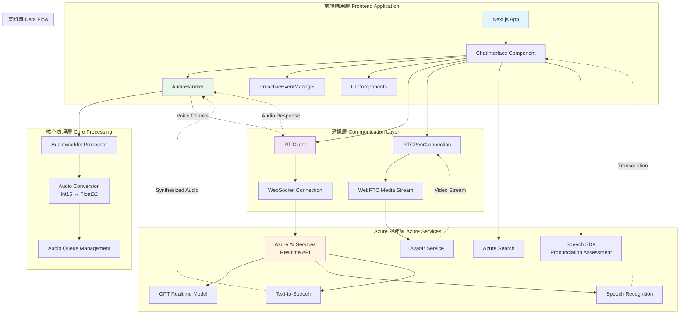
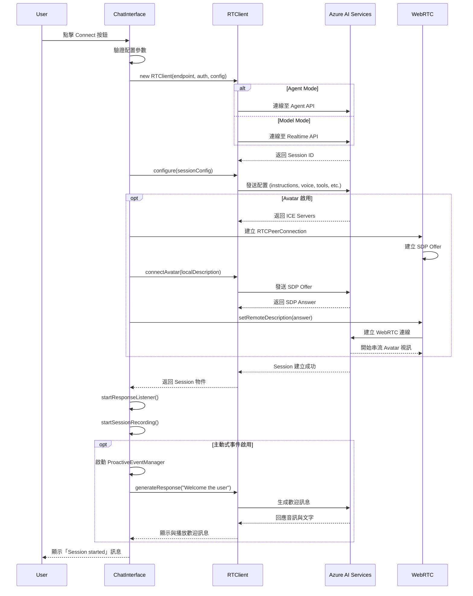
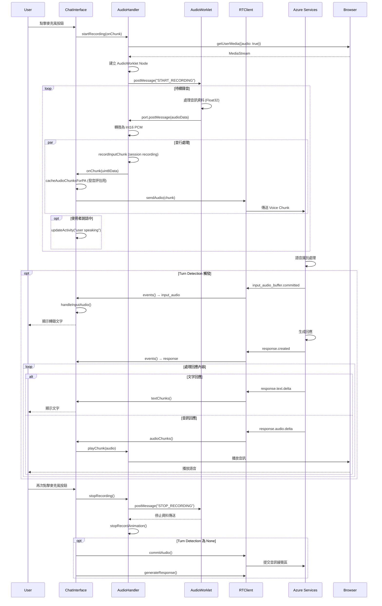
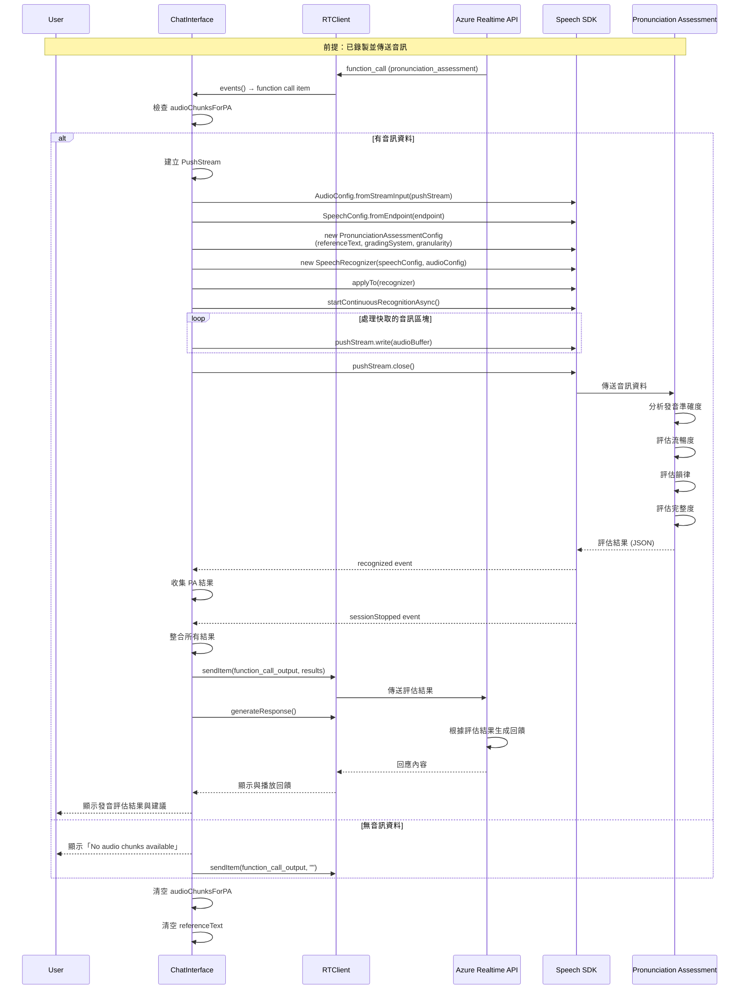
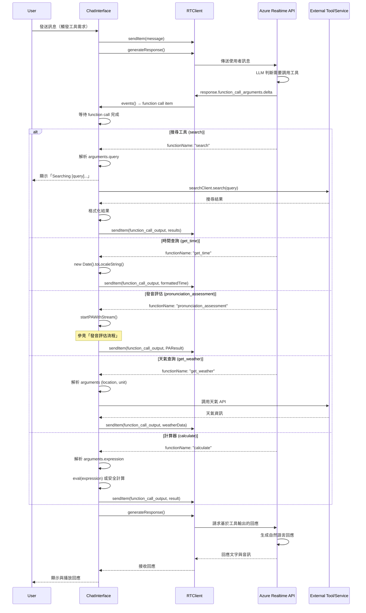

# Voice Live Avatar 技術文件

## 摘要 (Summary)

Voice Live Avatar 是一個基於 Azure AI Services 的即時語音互動應用程式，結合了語音識別、自然語言處理和虛擬化身功能。本應用程式使用 Next.js 和 React 框架建構，透過 WebRTC 技術實現即時音視訊串流，並整合 Azure Speech SDK 提供語音轉文字、文字轉語音和發音評估等功能。

本文件詳細說明了專案的程式碼架構、核心功能模組、資料流程以及開發時的重要注意事項，特別針對 voice chunk（語音區塊）處理和 phrase list（詞彙清單）功能進行深入說明。

---

## 目錄 (Table of Contents)

1. [技術堆疊](#技術堆疊)
2. [程式碼架構](#程式碼架構)
   - [目錄結構](#目錄結構)
   - [核心模組說明](#核心模組說明)
3. [重點功能](#重點功能)
   - [即時語音串流](#即時語音串流)
   - [虛擬化身整合](#虛擬化身整合)
   - [語音識別與轉錄](#語音識別與轉錄)
   - [工具函式整合](#工具函式整合)
   - [發音評估](#發音評估)
   - [主動式事件管理](#主動式事件管理)
4. [Voice Chunk 描述](#voice-chunk-描述)
   - [Voice Chunk 的定義與用途](#voice-chunk-的定義與用途)
   - [音訊處理流程](#音訊處理流程)
   - [音訊格式轉換](#音訊格式轉換)
5. [Phrase List 描述](#phrase-list-描述)
   - [Phrase List 的功能](#phrase-list-的功能)
   - [使用場景](#使用場景)
   - [配置方式](#配置方式)
6. [系統架構圖](#系統架構圖)
7. [互動流程圖](#互動流程圖)
   - [連線建立流程](#連線建立流程)
   - [語音錄製與傳送流程](#語音錄製與傳送流程)
   - [發音評估流程](#發音評估流程)
8. [注意事項](#注意事項)
   - [開發環境設定](#開發環境設定)
   - [音訊採樣率](#音訊採樣率)
   - [WebRTC 連線](#webrtc-連線)
   - [錯誤處理](#錯誤處理)
   - [效能優化](#效能優化)
   - [安全性考量](#安全性考量)
9. [部署建議](#部署建議)

---

## 技術堆疊

- **前端框架**: Next.js 16.0+, React 18.3+
- **UI 框架**: Tailwind CSS, Radix UI
- **語音 SDK**: Microsoft Cognitive Services Speech SDK 1.44+
- **即時通訊**: rt-client (Real-time Client) 0.5.2
- **WebRTC**: 原生 Web API
- **搜尋服務**: Azure Search Documents
- **語言**: TypeScript 5+
- **容器化**: Docker

---

## 程式碼架構

### 目錄結構

```
voice-live-avatar/
├── src/
│   ├── app/
│   │   ├── chat-interface.tsx    # 主要聊天介面元件
│   │   ├── page.tsx               # 應用程式入口頁面
│   │   ├── layout.tsx             # 頁面佈局
│   │   ├── globals.css            # 全域樣式
│   │   ├── index.css              # 索引頁樣式
│   │   └── svg.tsx                # SVG 圖示定義
│   ├── components/
│   │   └── ui/                    # Radix UI 元件庫
│   └── lib/
│       ├── audio.ts               # 音訊處理核心類別
│       ├── audioConverters.ts     # 音訊格式轉換工具
│       ├── proactive-event-manager.ts  # 主動式事件管理器
│       └── utils.ts               # 通用工具函式
├── public/                        # 靜態資源
├── package.json                   # 專案依賴配置
├── tsconfig.json                  # TypeScript 配置
├── Dockerfile                     # Docker 容器配置
└── README.md                      # 專案說明文件
```

### 核心模組說明

#### 1. **chat-interface.tsx**
   - **職責**: 應用程式的主要 UI 元件，管理所有使用者互動邏輯
   - **功能**:
     - 連線管理 (Azure AI Services)
     - 訊息顯示與處理
     - 錄音控制
     - 虛擬化身配置
     - 工具函式調用
     - 狀態管理
   - **重要狀態**:
     - `isConnected`: 連線狀態
     - `isRecording`: 錄音狀態
     - `messages`: 訊息歷史記錄
     - `clientRef`: RT Client 實例引用
     - `audioHandlerRef`: 音訊處理器引用

#### 2. **audio.ts (AudioHandler)**
   - **職責**: 處理所有音訊相關操作
   - **功能**:
     - 音訊錄製與串流
     - 音訊播放與佇列管理
     - 音訊視覺化動畫
     - 會話錄音時間軸
   - **關鍵方法**:
     - `startRecording()`: 開始錄音
     - `stopRecording()`: 停止錄音
     - `playChunk()`: 播放音訊區塊
     - `startStreamingPlayback()`: 開始串流播放
     - `startSessionRecording()`: 開始會話錄音

#### 3. **audioConverters.ts**
   - **職責**: 音訊格式轉換
   - **功能**:
     - `int16PCMToFloat32()`: 將 Int16 PCM 轉換為 Float32
     - `float32ToInt16PCM()`: 將 Float32 轉換為 Int16 PCM
     - `downsampleBuffer()`: 降低取樣率

#### 4. **proactive-event-manager.ts (ProactiveEventManager)**
   - **職責**: 管理主動式事件（如閒置偵測）
   - **功能**:
     - 活動時間追蹤
     - 閒置偵測
     - 自動觸發歡迎訊息
     - 閒置時自動互動

---

## 重點功能

### 即時語音串流

應用程式使用 WebRTC 和 AudioWorklet API 實現即時音訊串流：

- **錄音流程**:
  1. 透過 `navigator.mediaDevices.getUserMedia()` 獲取麥克風權限
  2. 使用 AudioWorklet (`audio-recorder-processor`) 處理原始音訊資料
  3. 將 Float32 音訊轉換為 Int16 PCM 格式
  4. 透過 RT Client 發送至 Azure 服務

- **播放流程**:
  1. 從 Azure 服務接收音訊 chunks
  2. 使用播放佇列管理音訊片段
  3. 透過 Web Audio API 的 AudioBufferSourceNode 播放
  4. 維持時間軸同步以避免重疊

### 虛擬化身整合

支援兩種虛擬化身類型：

1. **標準化身 (Standard Avatar)**:
   - 預設角色如 Lisa, Harry, Jeff 等
   - 支援不同風格（business, casual, formal）

2. **相片化身 (Photo Avatar)**:
   - 基於 VASA-1 模型
   - 支援自訂角色
   - 可配置背景圖片

**WebRTC 連線流程**:
- 建立 RTCPeerConnection
- 交換 SDP (Session Description Protocol)
- ICE 候選交換
- 建立音視訊軌道

### 語音識別與轉錄

- **自動語言偵測**: 支援多語言自動識別
- **即時轉錄**: 將語音即時轉換為文字
- **Turn Detection**: 
  - Server VAD (Voice Activity Detection)
  - Azure Semantic VAD
  - End-of-utterance Detection

### 工具函式整合

系統支援多種工具函式調用：

1. **search**: 知識庫搜尋
2. **get_time**: 時間查詢
3. **get_weather**: 天氣查詢
4. **calculate**: 計算器
5. **pronunciation_assessment**: 發音評估
6. **language_detection**: 語言偵測（系統工具）

### 發音評估

使用 Azure Speech SDK 進行發音評估：

- **評估維度**:
  - 準確度 (Accuracy)
  - 流暢度 (Fluency)
  - 完整度 (Completeness)
  - 韻律 (Prosody)

- **評分系統**: 百分制 (0-100)
- **粒度**: 音素級別 (Phoneme)

### 主動式事件管理

`ProactiveEventManager` 提供智能互動功能：

- **歡迎訊息**: 連線建立時自動問候
- **閒置偵測**: 監控使用者活動
- **自動回應**: 閒置一段時間後主動互動
- **活動追蹤**: 記錄使用者和系統活動時間

---

## Voice Chunk 描述

### Voice Chunk 的定義與用途

**Voice Chunk（語音區塊）** 是指在即時語音通訊中，將連續的音訊串流分割成小型資料塊進行處理和傳輸的單位。這種分塊處理機制是實現低延遲即時通訊的關鍵技術。

#### 在本專案中的應用：

1. **錄音 Voice Chunks**:
   - 由 AudioWorklet 處理器產生
   - 每個 chunk 包含一小段時間的音訊資料（通常幾十到幾百毫秒）
   - 格式：Int16 PCM，採樣率 24kHz
   - 透過 `onChunk` 回呼函式即時傳送

2. **播放 Voice Chunks**:
   - 從 RT Client 接收的音訊串流
   - 透過 `playChunk()` 方法加入播放佇列
   - 使用時間軸管理確保連續播放

3. **發音評估 Voice Chunks**:
   - 儲存在 `audioChunksForPA` 陣列中
   - 附帶時間戳記資訊
   - 用於後續的發音評估分析

### 音訊處理流程

```typescript
// Voice Chunk 的生命週期
interface AudioChunksForPA {
  audioBuffer: ArrayBuffer;  // 音訊資料
  timestamp: number;          // 時間戳記
}
```

**處理步驟**:
1. **擷取**: AudioWorklet 從麥克風擷取原始 Float32 音訊
2. **轉換**: 轉換為 Int16 PCM 格式
3. **快取**: 儲存至 `audioChunksForPA` 用於發音評估
4. **傳送**: 透過 RT Client 發送至 Azure 服務
5. **接收**: 從服務接收回應的音訊 chunks
6. **播放**: 將 chunks 加入播放佇列並播放

### 音訊格式轉換

為了支援不同的音訊格式需求，系統提供以下轉換功能：

```typescript
// Float32 轉 Int16 PCM
float32ToInt16PCM(input: Float32Array): Uint8Array

// Int16 PCM 轉 Float32
int16PCMToFloat32(uint8: Uint8Array): Float32Array

// 降低取樣率 (例如從 24kHz 降至 16kHz)
downsampleBuffer(buffer: Float32Array, inRate: number, outRate: number): Float32Array
```

**發音評估的特殊處理**:
- 錄音採樣率：24kHz
- 評估採樣率：16kHz
- 需要降取樣處理：`downsampleBuffer(floatData, 24000, 16000)`

---

## Phrase List 描述

### Phrase List 的功能

**Phrase List（詞彙清單）** 是一種語音識別優化技術，用於提高特定詞彙或短語的識別準確度。當系統遇到 Phrase List 中的詞彙時，會給予更高的權重，從而提升識別正確率。

### 使用場景

1. **專業術語識別**:
   - 醫療、法律、技術領域的專業詞彙
   - 產品名稱、品牌名稱
   - 公司內部術語

2. **多語言混合場景**:
   - 英文名稱在中文對話中
   - 技術術語在日常對話中

3. **特定情境對話**:
   - 客服系統的常用詞彙
   - 導航系統的地名
   - 訂餐系統的菜單項目

### 配置方式

在 `chat-interface.tsx` 中配置：

```typescript
const [phraseList, setPhraseList] = useState<string[]>([]);

// 在配置 session 時使用
const session = await clientRef.current.configure({
  input_audio_transcription: {
    model: "azure-speech",
    language: recognitionLanguage === "auto" ? undefined : recognitionLanguage,
    phrase_list: phraseList.length > 0 ? phraseList : undefined,
    // ...
  },
  // ...
});
```

**設定範例**:
```typescript
setPhraseList([
  "Azure",
  "Cognitive Services",
  "Speech SDK",
  "Voice Live Avatar",
  "Real-time API"
]);
```

### 最佳實踐

1. **限制數量**: 建議不超過 100 個詞彙，避免影響整體識別效能
2. **精確匹配**: 提供完整且正確的拼寫
3. **區分大小寫**: 某些語言需要注意大小寫
4. **避免過於常見的詞**: 不需要將常用詞加入清單
5. **定期更新**: 根據使用情境調整詞彙清單

### Custom Speech Models

除了 Phrase List，系統還支援自訂語音模型：

```typescript
const [customSpeechModels, setCustomSpeechModels] = useState<Record<string, string>>({});

// 配置範例
setCustomSpeechModels({
  "en-US": "model-id-for-english",
  "zh-CN": "model-id-for-chinese"
});
```

---

## 系統架構圖



---

## 互動流程圖

### 連線建立流程



### 語音錄製與傳送流程



### 發音評估流程



### 工具函式調用流程



---

## 注意事項

### 開發環境設定

1. **Node.js 版本**: 需要 Node.js 20+ 以支援最新的 Next.js 功能
2. **環境變數**: 
   - 可透過 `/config` 端點提供配置
   - 支援 Entra ID 認證 token
   - 支援 API Key 認證

3. **瀏覽器相容性**:
   - 需要支援 WebRTC 的現代瀏覽器
   - 需要支援 AudioWorklet API（Chrome 66+, Firefox 76+, Safari 14.1+）
   - 行動裝置支援需特別測試

### 音訊採樣率

- **錄音採樣率**: 24kHz（固定）
- **播放採樣率**: 24kHz（固定）
- **發音評估採樣率**: 16kHz（需降取樣）
- **注意**: 不同的音訊處理階段可能需要不同的採樣率，需注意轉換

### WebRTC 連線

1. **ICE 候選收集**: 
   - 需要等待 2 秒以確保 ICE 候選收集完成
   - 防火牆設定可能影響連線

2. **SDP 交換**:
   - 先建立 local description (offer)
   - 再設定 remote description (answer)

3. **媒體軌道**:
   - 需要添加 video 和 audio transceivers
   - direction 設定為 "sendrecv"

4. **Data Channel**:
   - 用於接收 Avatar 事件訊息
   - 需要建立名為 "eventChannel" 的 data channel

### 錯誤處理

1. **連線失敗**:
   - 顯示錯誤訊息給使用者
   - 檢查 endpoint 和認證資訊
   - 確認區域支援 (eastus2, swedencentral)

2. **音訊裝置問題**:
   - 處理 getUserMedia 權限拒絕
   - 處理裝置不可用的情況
   - 提供友善的錯誤訊息

3. **網路問題**:
   - 實作重連機制
   - 監控 WebSocket 連線狀態
   - 處理 WebRTC 連線斷線

### 效能優化

1. **音訊佇列管理**:
   - 使用播放佇列避免音訊重疊
   - 維護時間軸同步
   - 適時清理已播放的資源

2. **記憶體管理**:
   - 及時釋放不需要的 AudioBufferSourceNode
   - 限制 audioChunksForPA 的大小
   - 定期清理訊息歷史記錄

3. **視覺化效能**:
   - 使用 requestAnimationFrame 進行動畫
   - 避免頻繁的 DOM 操作
   - 使用 CSS transform 而非 position 進行動畫

### 安全性考量

1. **API Key 保護**:
   - 不要將 API Key 硬編碼在前端
   - 使用後端代理或配置端點
   - 優先使用 Entra ID Token 認證

2. **XSS 防護**:
   - 使用 ReactMarkdown 渲染訊息內容
   - 避免使用 dangerouslySetInnerHTML
   - 驗證並清理使用者輸入

3. **CORS 設定**:
   - 正確設定 Azure 服務的 CORS
   - 限制允許的來源網域

4. **資料隱私**:
   - 注意音訊錄製的隱私權問題
   - 提供清楚的隱私政策
   - 遵守 GDPR 等相關法規

### Turn Detection 注意事項

1. **Server VAD**:
   - 伺服器端判斷語音結束
   - 延遲較低但可能誤判
   - 適合一般對話場景

2. **Azure Semantic VAD**:
   - 語義理解判斷語音結束
   - 準確度較高但延遲稍高
   - 支援 filler words 移除
   - 適合需要高準確度的場景

3. **None**:
   - 手動控制錄音結束
   - 需要使用者點擊按鈕結束
   - 適合需要精確控制的場景

### Avatar 配置注意事項

1. **區域限制**:
   - Avatar 功能僅在特定區域可用
   - 支援區域: Southeast Asia, North Europe, West Europe, Sweden Central, South Central US, East US 2, West US 2

2. **視訊參數**:
   - Codec: H.264
   - 可設定裁切區域 (crop)
   - 可設定背景圖片

3. **Photo Avatar**:
   - 使用 VASA-1 模型
   - 支援自訂角色
   - 需要特殊的邊框圓角處理
   - 播放時需延遲 240ms 以跳過黑屏

### 主動式事件管理注意事項

1. **活動追蹤**:
   - 需要在適當的時機調用 `updateActivity()`
   - 包括: 使用者說話、Agent 說話、使用者互動

2. **閒置時間設定**:
   - 預設 10 秒（10000ms）
   - 可根據應用場景調整
   - 不宜設定過短以免過度干擾

3. **記憶體清理**:
   - 斷線時需呼叫 `stop()` 清理計時器
   - 避免記憶體洩漏

---

## 部署建議

### Docker 部署

1. **建置映像**:
   ```bash
   docker build -t voice-live-avatar .
   ```

2. **執行容器**:
   ```bash
   docker run --rm -p 3000:3000 voice-live-avatar
   ```

3. **環境變數**:
   - 透過後端服務提供 `/config` 端點
   - 或使用 Docker 環境變數

### Azure Container Apps

1. **推送至 ACR**:
   ```bash
   docker tag voice-live-avatar <registry>.azurecr.io/voice-live-avatar:latest
   docker push <registry>.azurecr.io/voice-live-avatar:latest
   ```

2. **建立 Container App**:
   - 選擇適當的區域（支援 Avatar 功能）
   - 設定環境變數
   - 配置 Ingress (Port 3000)

3. **擴展設定**:
   - 設定最小/最大副本數
   - 配置 CPU 和記憶體資源
   - 啟用自動擴展

### 生產環境檢查清單

- [ ] 設定正確的 Azure 服務端點
- [ ] 使用 Entra ID Token 而非 API Key
- [ ] 啟用 HTTPS
- [ ] 配置 CDN 加速靜態資源
- [ ] 設定適當的 CORS 政策
- [ ] 實作日誌記錄與監控
- [ ] 設定錯誤追蹤（如 Application Insights）
- [ ] 實作速率限制
- [ ] 準備災難復原計畫
- [ ] 進行負載測試
- [ ] 建立健康檢查端點
- [ ] 設定自動擴展策略

---

## 結語

Voice Live Avatar 是一個功能豐富的即時語音互動應用程式，整合了多項 Azure AI 服務。開發時需要特別注意音訊處理的細節、WebRTC 連線的穩定性，以及不同功能模組之間的協調。透過合理的架構設計和錯誤處理機制，可以提供流暢且可靠的使用者體驗。

本文件涵蓋了專案的核心技術細節，包括 Voice Chunk 的處理機制和 Phrase List 的應用方式。在實際開發過程中，建議參考 Azure 官方文件以獲取最新的 API 規範和最佳實踐。

---

**文件版本**: 1.0  
**最後更新**: 2025-12-07  
**維護者**: 開發團隊  
**聯絡方式**: 請透過專案 Issues 提出問題或建議
